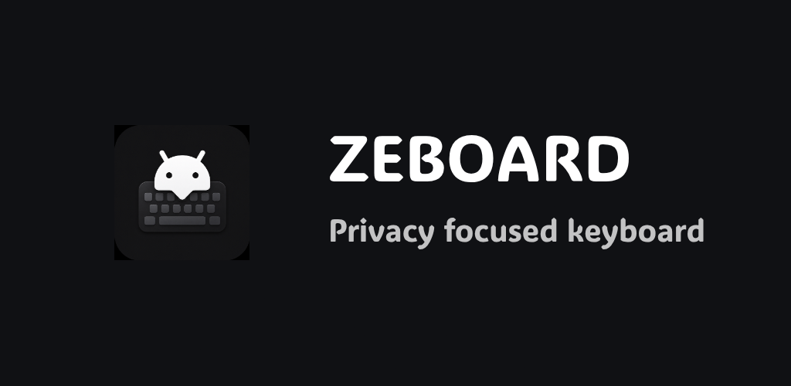

<p align="center">
  
</p>

<h1 align="center">ZEBOARD</h1>

<p align="center">
  A private, fully offline, deeply customizable Android keyboard.
</p>

<p align="center">
  <a href="https://github.com/alwayszihanx/ZEBOARD">github.com/alwayszihanx/ZEBOARD</a>
</p>

---

## About

**ZEBOARD** is a modern Android keyboard built for privacy and personalization. It runs
**100% offline** — it has no internet permission and never transfers any of your data.
On top of a rock-solid typing engine, ZEBOARD adds a large collection of beautiful themes,
selectable fonts, and strong privacy controls.

## Features

- **Fully offline** — no internet permission, no telemetry, no online accounts, no data transfer.
- **Incognito mode** — turn off all learning so nothing you type is saved or added to dictionaries.
- **20 curated themes** — Material You, AMOLED Black, Dracula, Nord, Catppuccin Mocha, Tokyo Night,
  Gruvbox, One Dark, Everforest, Rosé Pine, Solarized Dark, Monokai, Glass, Cyberpunk, Ocean,
  Forest, Sunset, Aurora, Midnight, and Pixel.
- **Custom fonts** — pick from a bundled font pack (Noto Sans/Serif/Mono, Source Code Pro,
  Carlito, Caladea, Liberation, Red Hat, Cantarell, DejaVu Sans, Anton, and more).
- **Custom themes** — import your own themes and tweak colors, backgrounds, and key styling.
- **Powerful typing** — glide typing, multilingual layouts, and on-device prediction.

## Building

Open the project in Android Studio and build it, or use Gradle:

```bash
# Debug build (for testing)
./gradlew assembleUnstableDebug

# Signed release build (requires keystore.properties, see below)
./gradlew assembleStableRelease

# Play Store bundle
./gradlew bundleStableRelease
```

> This project requires JDK 17. If your system default is newer, set
> `JAVA_HOME` to a JDK 17 install before running Gradle.

### Signing a release build

Create a keystore and a `keystore.properties` file in the project root:

```properties
storeFile=/absolute/path/to/your-release.jks
storePassword=YOUR_STORE_PASSWORD
keyAlias=YOUR_ALIAS
keyPassword=YOUR_KEY_PASSWORD
```

Keep your keystore and passwords private — they are excluded from version control via `.gitignore`.

## Credits & Acknowledgements

ZEBOARD stands on the shoulders of excellent open-source work. Huge thanks to:

- **[FUTO](https://futo.org/) & [FUTO Keyboard](https://keyboard.futo.org/)** — ZEBOARD is a fork of
  FUTO Keyboard. The privacy-first foundation, transformer prediction, glide typing, theming system,
  and modern Compose settings all originate from FUTO's outstanding work.
- **[OpenBoard](https://github.com/openboard-team/openboard)** — for demonstrating how a clean,
  open-source AOSP-based keyboard should be built and maintained.
- **[LatinIME — The Android Open-Source Keyboard](https://android.googlesource.com/platform/packages/inputmethods/LatinIME)**
  by the Android Open Source Project, which is the original basis of this lineage.

Thank you to these projects and their contributors. Without them, ZEBOARD would not exist.

## License

This project is a fork of FUTO Keyboard and remains under the
[FUTO Source First License 1.1](LICENSE.md). Portions derived from AOSP LatinIME are under the
Apache License 2.0. See [LICENSE.md](LICENSE.md) and [NOTICE](NOTICE) for details.
